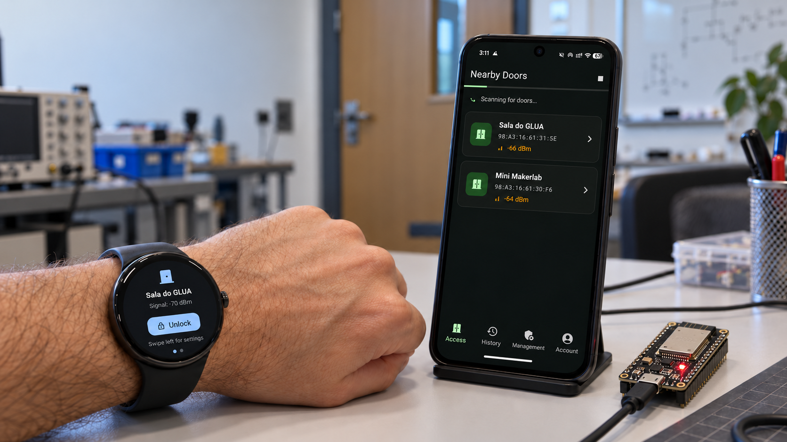
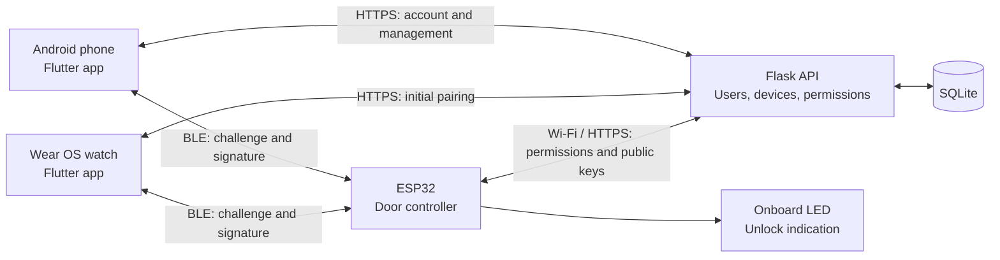
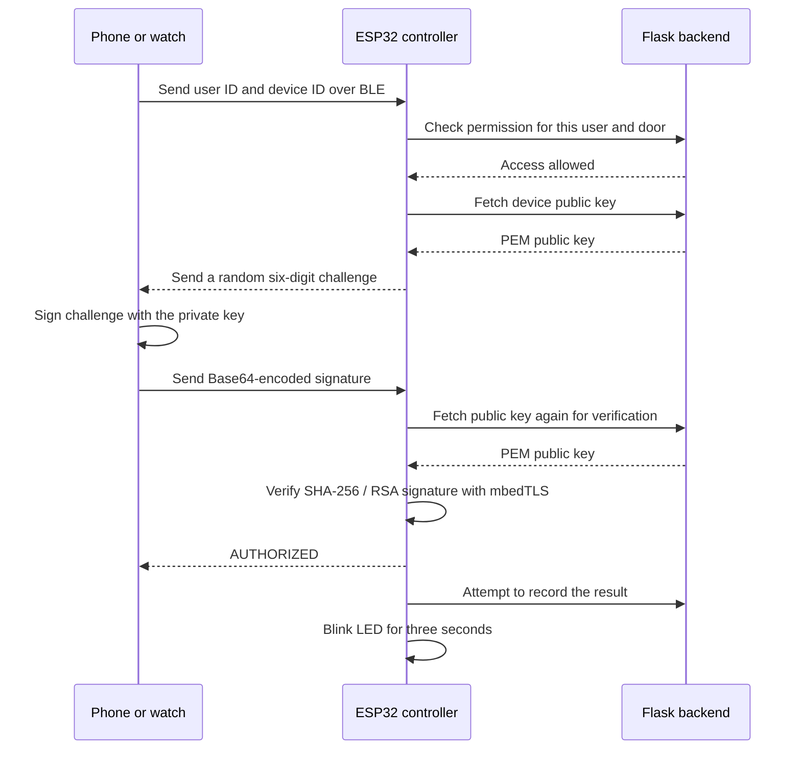

# Aditus - Door Access from a Phone or a Watch

Aditus is a door access system I built with an Android app, a Wear OS app, an ESP32 controller, and a Flask backend. It brings together the whole process: creating accounts, registering devices, assigning access to rooms, and authenticating an unlock over Bluetooth Low Energy.

Each phone and watch generates its own RSA key pair. The backend decides who can access a door, and the ESP32 verifies a signature from the device before accepting the request.

*The watch completing the unlock flow. In this prototype, the ESP32 blinks its onboard LED to represent the door opening. [Watch the original video](screenshots/smartwatch_unlock_flow.mp4).*

[Setup and technical documentation](DOCUMENTATION.md) · [Original project report](report.pdf)

## Why I Built It

The starting point was a familiar problem: getting into a lab or an office means carrying another key or access card, even though you already have a phone with you. I wanted to build a system around the devices people already carry, including a watch that could open a door without taking a phone out of a pocket.

That also meant thinking beyond the unlock button. A person might have a phone, a tablet, and a watch. One of those devices might get lost. A whole class might need access to a lab, with an exception for one person. Aditus gives each device its own identity and keeps room permissions in one place, so those changes can be handled without replacing everyone else's keys.

## What It Does

- Discovers nearby door controllers over BLE and lists them by signal strength.
- Authenticates unlock requests with RSA-2048 signatures and SHA-256.
- Pairs a Wear OS watch through a temporary code, then lets it talk directly to doors.
- Registers multiple devices per account and lets users revoke them individually.
- Provides user, group, door, and permission management inside the phone app.
- Includes access history, PIN and biometric protection, and Material 3 theme settings.

## How the System Fits Together

| Component | Built with | Responsibility |
| --- | --- | --- |
| [Phone app](smartphone_client_app/) | Dart, Flutter, BLoC, Material 3 | Login, device registration, door discovery, unlocking, account settings, and administration |
| [Watch app](smartwatch_client_app/) | Dart, Flutter, BLoC, Wear OS | Pairing, nearby door selection, and unlocking from the wrist |
| [Door controller](esp32_door_controller/esp32_door_controller.ino) | C++, Arduino, ESP32, mbedTLS | BLE communication, permission checks, signature verification, and the unlock signal |
| [Backend](aditus_backend_service/) | Python, Flask, SQLAlchemy, SQLite, JWT | Accounts, public keys, groups, door permissions, pairing sessions, and access records |

The ESP32 has its own connection to the backend. It looks up permissions and public keys for each request, so the phone does not have to forward those requests for it. On startup, the controller identifies itself by its BLE MAC address, retrieves its configured door name, and starts advertising under that name.

This arrangement is particularly useful for the watch: once paired, it can authenticate over BLE without the phone nearby or an internet connection of its own. The controller still needs to reach the backend. The phone app also checks its session online when it starts, so it does not have a complete offline startup flow.

## Giving Each Device Its Own Key

Accounts are created by an administrator. On the phone, the first steps are signing in, choosing a four-to-six-digit PIN, and registering the device with a name. Biometric authentication can be enabled during setup.

<table>
  <tr>
    <td align="center"> <b>Sign in</b></td>
    <td align="center"> <b>Set up the PIN</b></td>
    <td align="center"> <b>Register the phone</b></td>
  </tr>
</table>

Registration generates an RSA-2048 key pair locally using PointyCastle. The private key stays in the device's encrypted storage; the public key goes to the backend and is associated with that device and its owner. A second phone or a watch gets a separate key pair.

The account session uses JWT access and refresh tokens. The local PIN or biometric check controls entry into the phone app, while the device key is used during the door's challenge-response exchange. Keeping these roles separate lets the backend manage an account with several independently registered devices.

## What Happens When You Tap Unlock

The phone scans for Aditus's BLE service and shows the door names advertised by the controllers. Results update as advertisements arrive and are sorted by RSSI, with the strongest signal first. That makes nearby doors easier to find, though signal strength is only a rough indication of proximity.

<table>
  <tr>
    <td align="center"> <b>Discover nearby doors</b></td>
    <td align="center"> <b>Confirm the door</b></td>
    <td align="center"> <b>Follow the authentication</b></td>
  </tr>
</table>

After confirmation, the app connects to the ESP32 and subscribes to its challenge and status characteristics. A successful request follows this sequence:

A permission denial stops the exchange before a challenge is issued. A missing key or an invalid signature also prevents the unlock. The apps display progress through connecting, discovering services, authenticating, signing, and unlocking, with failure states for errors and timeouts.

One useful integration detail is the signature itself: an RSA-2048 signature is 256 bytes, or 344 characters after Base64 encoding. Both clients enable BLE long writes when sending it. The cryptographic boundary also crosses languages and libraries: Dart produces the PEM key and signature, and mbedTLS on the ESP32 parses and verifies them.

## Moving the Unlock Button to the Wrist

I wanted the watch to be useful on its own after setup. The phone starts a pairing session with the backend and displays a six-digit code, valid for five minutes. The watch generates its own key pair and submits the code, its name, and its public key. The backend registers it under the same account and marks the code as used.

<table>
  <tr>
    <td align="center"> <b>Pairing code on the phone</b></td>
    <td align="center"> <b>Start pairing on the watch</b></td>
    <td align="center"> <b>Enter the code</b></td>
  </tr>
</table>

The watch stores its own device ID, owner ID, and keys. It does not need to copy the phone's private key or keep a phone connection alive to unlock a door.

The main screen selects the door with the strongest signal and presents one unlock button. Swiping left opens settings, where the watch can clear its local registration and keys. Revoking its backend device record is a separate action in the phone app.

<table>
  <tr>
    <td align="center"> <b>Door access from the wrist</b></td>
    <td align="center"> <b>Reset local registration</b></td>
  </tr>
</table>

## Managing Who Can Get In

The phone app also contains the administration screens. An administrator can register a door by its controller's BLE MAC address, add a name and location, change its permissions, or mark it inactive. The user and door lists include search and filters; the group list has search as well.

<table>
  <tr>
    <td align="center"> <b>Administration</b></td>
    <td align="center"> <b>Registered doors</b></td>
    <td align="center"> <b>Door configuration</b></td>
  </tr>
</table>

User management covers creating accounts, editing names and email addresses, changing roles, and managing registered devices and group memberships. An administrator's management privileges do not automatically grant permission to unlock every door.

<table>
  <tr>
    <td align="center"> <b>Find a user</b></td>
    <td align="center"> <b>Inspect the account</b></td>
    <td align="center"> <b>Edit details and role</b></td>
  </tr>
</table>

Groups handle the common case of several people needing the same access. For example, a Students group can be granted access to a lab. A user exception can then deny one member access without changing the rest of the group. Members can be added together through a selection dialog.

<table>
  <tr>
    <td align="center"> <b>Organize users into groups</b></td>
    <td align="center"> <b>Inspect a group</b></td>
    <td align="center"> <b>Add members together</b></td>
  </tr>
</table>

The door's access screen manages direct user grants, group grants, user exceptions, and group exceptions. In the current implementation, a user exception overrides all grants. A group exception excludes access through that particular group; another allowed group or a direct user grant can still permit access. The exact evaluation order is in the [permission reference](DOCUMENTATION.md#access-rules).

Some navigation entries visible in the screenshots are unfinished: the admin log shortcuts and the group's door-access shortcut are placeholders. Door permissions are managed from the door detail screen.

## Devices, History, and Everyday Settings

The account area brings together device management, group memberships, watch pairing, and security settings. A lost or retired device can be revoked individually. Its public key is then unavailable to controllers on subsequent requests, while the account's other device registrations remain in place.

The history screen displays stored access attempts with the door name, timestamp, outcome, and failure reason. It loads records in pages of 20 and supports refresh and loading more. The backend also exposes filters by user, door, device, date, and outcome for administrators. This repository snapshot has a mismatch between the firmware's log URL and the backend route; the [setup notes](DOCUMENTATION.md#known-limitations) explain the correction needed to receive new controller logs.

<table>
  <tr>
    <td align="center"> <b>Manage each device</b></td>
    <td align="center"> <b>Review access history</b></td>
    <td align="center"> <b>Account settings</b></td>
  </tr>
</table>

I used Material 3 for the phone UI, with light, dark, and system themes. Colors can follow the Android wallpaper through Material You or use one of five preset colors. Password changes, PIN changes, and the biometric toggle are available from the same account area.

<table>
  <tr>
    <td align="center"> <b>Change the password</b></td>
    <td align="center"> <b>Change the local PIN</b></td>
    <td align="center"> <b>Choose a theme and color</b></td>
  </tr>
</table>

## Inside the Code

The phone app is organized by feature, with presentation, domain use cases, and data repositories used across device, account, group, and admin management. Shared BLE, cryptography, storage, API, and theme code lives under `core/`. Authentication and unlocking have their own BLoCs that coordinate services directly.

That separation is useful in the unlock flow: the UI renders progress while `DoorUnlockBloc` coordinates BLE discovery, signing, responses, and disconnects. `DoorDiscoveryBloc` handles scanning separately. The watch uses the same protocol and a smaller set of screens and BLoCs.

The Flask service uses an application factory and route blueprints. SQLAlchemy models connect users to their devices, groups, door grants, exceptions, and access logs; a separate model holds temporary pairing sessions. The ESP32 sketch contains the BLE callbacks, backend requests, signature verification, and LED state machine.

For a closer look, these are the main entry points:

- [Phone unlock coordinator](smartphone_client_app/lib/features/door_unlock/presentation/bloc/door_unlock_bloc.dart) and [BLE service](smartphone_client_app/lib/core/services/ble_service.dart).
- [RSA key generation, PEM encoding, and signing](smartphone_client_app/lib/core/security/crypto_service.dart).
- [Watch pairing client](smartwatch_client_app/lib/services/pairing_service.dart) and [backend device routes](aditus_backend_service/app/routes/devices.py).
- [Permission evaluation](aditus_backend_service/app/models/user.py) and [ESP32 firmware](esp32_door_controller/esp32_door_controller.ino).
